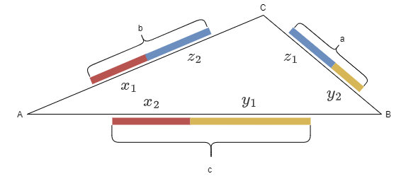
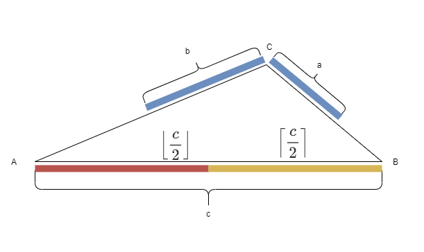
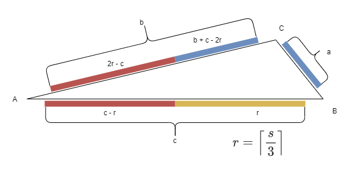

# [编程题]吃葡萄

# 1 问题

## 1.1 问题描述

有三种葡萄，每种分别有 $a,b,c$ 颗。有三个人，第一个人只吃第1, 2种葡萄，第二个人只吃第2, 3种葡萄，第三个人只吃第1, 3种葡萄。
适当安排三个人使得吃完所有的葡萄,并且且三个人中吃的最多的那个人吃得尽量少。

### 1.1.1 输入

 $a, b, c$ 都为正整数。

### 1.1.2 输出

三个人中吃的最多的那个人吃的数量。

## 1.2 Question in English

There are three kinds of grapes, each with a, b, and c pieces, respectively.
There are three individuals: The first person only eats the 1st and 2nd types of grapes, the second person only eats the 2nd and 3rd types, and the third person only eats the 1st and 3rd types.
They should eat up all of the grapes, and the person who eats the most should eat as few as possible.

### 1.2.1 Inputs

 $a, b, c$ are all positive integers.

### 1.2.2 Outputs

The number of grapes that the person eats the most.

## 2 思路

这其实是一道数学题，要用三角形可视化和不等式推导，以及贪心法。

# 3 问题可视化

如下图，三个人分别站在三角形的顶点 $A, B, C$ 上。葡萄为粗的线段。每个人吃的葡萄分别用红色，黄色和蓝色表示。注意这些线段不一定能组成一个三角形，所以并没有用三角形的三条边表示。




# 4 问题公式化

假设每个人吃掉的葡萄数分别为：

```math
\begin{equation} 
\begin{gathered}
x = x_1 +x_2 \\
y = y_1 + y_2 \\
z = z_1 + z_2 
\end{gathered}
\end{equation} \label{eq1} \tag{1}
```
其中 $x, y, z$ 都为非负整数，且满足
```math
\begin{equation} 
\begin{gathered}
y_1 + x_2 = c \\
z_1 + y_2 = a \\
x_1 + z_2 = b
\end{gathered}
\end{equation} \label{eq2} \tag{2}
```
则问题为：

对于所有满足上述要求的 $x, y, z$ ，求 $\min \left (\max \left (x, y, z \right ) \right )$ 。


# 5 推理

不失一般性，假设 
```math
\begin{equation} a \leq b \leq c \end{equation} \label{eq3} \tag{3}
```
令
```math
s = a + b + c \label{eq4} \tag{4}
```
由于三个人把所有的葡萄都吃完，因此 $x + y + z = a + b + c$

所以 
```math
\begin{equation} 
\begin{gathered}
3 \cdot \max \left (x, y, z \right ) \ge x + y + z = a + b + c = s \\
\implies \max \left (x, y, z \right ) \ge \dfrac {s} {3} 
\end{gathered}
\end{equation} \label{eq5} \tag{5}
```
由于一种葡萄最多由两个人吃完，可得 $x_2 + y_1 = c$

所以 
```math
\begin{equation} 
\begin{gathered}
2 \cdot \max \left (x, y, z \right ) \ge x + y \ge x_2 + y_1 = c  \\
\implies \max \left (x, y, z \right ) \ge \dfrac {c} {2}
\end{gathered}
\end{equation} \label{eq6} \tag{6}
```


由不等式  $(\ref {eq5} )$ , $( \ref {eq6} )$可得 
```math
\begin {equation} 
\begin{gathered}
\max \left (x, y, z \right ) \ge \max \left ( \dfrac {s} {3}, \dfrac {c} {2} \right ) \\
\implies \max \left (x, y, z \right ) \ge \max \left ( \left \lceil \dfrac {s} {3}  \right \rceil, \left \lceil \dfrac {c} {2} \right \rceil \right )
\end{gathered}
\end {equation} \label {eq7} \tag{7}
```
$\max \left ( \left \lceil \dfrac {s} {3}  \right \rceil, \left \lceil \dfrac {c} {2} \right \rceil \right )$ 即为答案。


# 6 证明


## 6.1 情况一

若 $\dfrac {s} {3} \le \dfrac {c} {2}$ ，则
```math
\begin{equation}
\begin{gathered}
\dfrac {s} {3} \le \dfrac {c} {2} \implies \dfrac { a + b + c } {3} \le \dfrac {c} {2} \\
\implies 2 \left (a + b + c \right ) \le 3 c  \\
\implies 2 \left (a + b \right ) \le c  \\
\implies a + b  \le \dfrac {c} {2}
\end{gathered}
\end{equation}
\label {eq8} \tag{8}
```
此时需要证明存在非负整数 $x, y, z$  满足 $\max \left (x, y, z \right ) = \left \lceil \dfrac {c} {2} \right \rceil$ 。

则可让 $B$ 吃掉 $\left \lceil \dfrac {c} {2} \right \rceil$ ， $A$ 吃掉 $\left \lfloor \dfrac {c} {2} \right \rfloor$ ， $C$ 吃掉剩下的两种葡萄 $a + b$ 。此时
```math
\begin {equation} 
\begin{gathered}
\max \left (x, y, z \right ) = \max \left (\left \lfloor \dfrac {c} {2} \right \rfloor, \left \lceil \dfrac {c} {2} \right \rceil, a + b \right ) = \left \lceil \dfrac {c} {2} \right \rceil 
\end{gathered}
\end {equation}
\label {eq9} \tag{9}
```


证明完毕。

## 6.2 情况二

否则


```math
\begin{equation} 
\begin{gathered}
\dfrac {s} {3} \gt \dfrac {c} {2}
\end{gathered}
\end{equation} \label{eq10} \tag{10}
```


此时需要证明存在非负整数 $x, y, z$  满足 $\max \left (x, y, z \right ) = \left \lceil \dfrac {s} {3} \right \rceil$ 。

由 $(\ref {eq10} ) $ 可得
```math
\begin {equation} 
\begin{gathered}
a + b  \gt \dfrac {c} {2}
\end{gathered}
\end {equation} 
\label {eq11} \tag{11}
```


为方便表示，假设 
```math
\begin {equation} 
\begin{gathered}
r = \left \lceil \dfrac {s} {3} \right \rceil
\end{gathered}
\end {equation} 
\label {eq12} \tag{12}
```


则需要证明 $\max \left (x, y, z \right ) = r$

则可按照如下图方式使用贪心法进行分配：




由 $(\ref {eq3} )$ 得  $a \le b \le c$ 。 $c$ 最大，因此优先分配 $c$ 。 $a$ 最小，因此最后分配。所以让 $B$ 专注于吃 $c$，然后让 $A$ 吃掉 $c$ 的剩下一部分和一部分 $b$ 。 最后 $C$ 吃掉 $b$ 剩下的部分和全部的 $a$。注意每个人最多分配 $r$ 个葡萄。

可得：
```math
\begin {equation} 
\begin {gathered}
x_1 = 2r - c = 2 \left \lceil \dfrac {s} {3} \right \rceil - c \\
x_2 = c - r = c - \left \lceil \dfrac {s} {3} \right \rceil \\
y_1 = r = \left \lceil \dfrac {s} {3} \right \rceil \\
y_2 = 0 \\
z_1 = a \\
z_2 = b + c - 2r = b + c - 2 \left \lceil \dfrac {s} {3} \right \rceil 
\end {gathered}
\end {equation}
\label {eq13} \tag{13}
```


接下来证明 $(\ref {eq13} )$ 中的所有值都 $\ge 0$ ：

由 $(\ref {eq11} )$ 得
```math
2 \cdot \dfrac {s} {3} - c = 2 \cdot  \dfrac { a + b + c } {3} - c = \dfrac { 2 \left (a + b \right ) - c } {3} \gt 0
```
因此
```math
\begin {equation}
\begin {gathered}
x_1 > 0
\end {gathered}
\end {equation}
\label {eq14} \tag{14}
```
由 $(\ref {eq3} )$ 得


```math
c - \dfrac {s} {3} = c - \dfrac { a + b + c } {3} = \dfrac { 2c - \left ( a + b\right ) } {3} \ge 0 \\

 b + c - 2 \cdot \dfrac {s} {3} =  b + c - 2 \cdot \dfrac {a + b + c} {3} = \dfrac { \left ( b + c \right ) - 2a } {3} \ge 0
```
因此
```math
\begin {equation}
\begin {gathered}
x_2 \ge 0, z_2 \ge 0
\end {gathered}
\end {equation}
\label {eq15} \tag{15}
```
由 $(\ref {eq13} )$ ，  $(\ref {eq14} )$，  $(\ref {eq15} )$ 可得 $(\ref {eq13} )$ 中的所有值都 $\ge 0$ 。


然后证明  $\max \left (x, y, z \right ) = r$ ：

由 $(\ref {eq1} )$ ， $(\ref {eq13} )$ 可得：
```math
\begin {equation}
\begin {gathered}
x = x_1 + x_2 = 2r - c + c - r = r \\
y = y_1 + y_2 = r + 0 = r \\
z = a + b + c - 2r = a + b + c - 2 \left \lceil \dfrac {s} {3} \right \rceil
\end {gathered}
\end {equation}
\label {eq16} \tag{16}
```
由于 
```math
a + b + c - 2 \cdot \dfrac {s} {3} = a + b + c - 2 \cdot \dfrac {a + b + c} {3} = \dfrac {a + b + c} {3}
```
因此
```math
\begin {equation}
\begin {gathered}
z = a + b + c - 2 \left \lceil \dfrac {s} {3} \right \rceil = \left \lfloor \dfrac {a + b + c} {3} \right \rfloor \le \left \lceil \dfrac {a + b + c} {3} \right \rceil = r
\end {gathered}
\end {equation}
\label {eq17} \tag{17}
```


由 $(\ref {eq16} )$ ， $(\ref {eq17} )$ 得：
```math
\max \left (x, y, z \right ) = r
```


证明完毕。


# 7 编程答案


```python
def find_min_max(a, b, c):
    return max((a + b + c + 3 - 1) // 3, (max(a, b, c) + 2 - 1) // 2)
```

