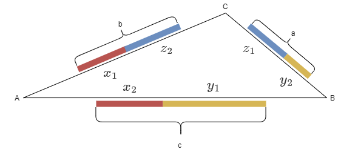
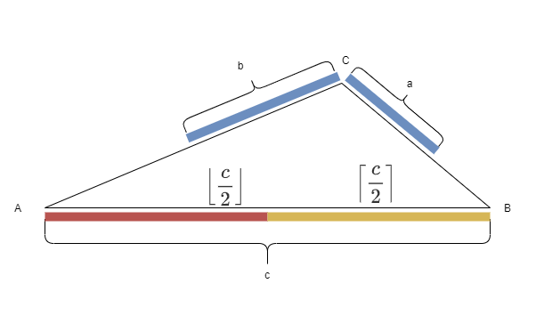
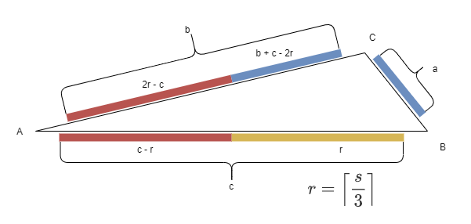

# Eat Grapes

Source: [Nowcoder](https://www.nowcoder.com/questionTerminal/14c0359fb77a48319f0122ec175c9ada)

# 1 Problem

## 1.1 Description

There are three kinds of grapes, with $a$, $b$, and $c$ grapes respectively.
There are three people:

- Person 1 can only eat grape types 1 and 2.
- Person 2 can only eat grape types 2 and 3.
- Person 3 can only eat grape types 1 and 3.

Arrange the three people so that all grapes are eaten, and the maximum number of grapes eaten by any one person is as small as possible.

### 1.1.1 Input

$a$, $b$, and $c$ are positive integers.

### 1.1.2 Output

The minimum possible value of the number of grapes eaten by the person who eats the most.

# 2 Idea

This is essentially a math problem. It can be solved with a triangle-style visualization, inequality derivation, and a greedy construction.

# 3 Visualization

As shown below, the three people stand at vertices $A$, $B$, and $C$ of a triangle. The grapes are represented by thick line segments, and the grapes eaten by each person are shown in red, yellow, and blue. These segments do not necessarily form an actual triangle, so the three grape types are not drawn as the three sides of a triangle.



# 4 Problem Model

Assume the numbers of grapes eaten by the three people are:

$$
\begin{gathered}
x = x_1 + x_2 \\
y = y_1 + y_2 \\
z = z_1 + z_2
\end{gathered} \qquad (1)
$$

where $x$, $y$, and $z$ are non-negative integers, and:

$$
\begin{gathered}
y_1 + x_2 = c \\
z_1 + y_2 = a \\
x_1 + z_2 = b
\end{gathered} \qquad (2)
$$

The problem is to find:

$$
\min \left(\max \left(x, y, z \right)\right)
$$

over all $x$, $y$, and $z$ satisfying Equation (1) and Equation (2).

# 5 Lower Bound Derivation

Without loss of generality, assume:

$$
a \leq b \leq c \qquad (3)
$$

Let:

$$
s = a + b + c \qquad (4)
$$

Since all grapes are eaten, $x + y + z = a + b + c$. Therefore:

$$
\begin{gathered}
3 \cdot \max \left(x, y, z \right) \ge x + y + z = a + b + c = s \\
\implies \max \left(x, y, z \right) \ge \dfrac{s}{3}
\end{gathered} \qquad (5)
$$

Also, any one grape type can be eaten by at most two people. For the largest grape type $c$, we have $x_2 + y_1 = c$. Therefore:

$$
\begin{gathered}
2 \cdot \max \left(x, y, z \right) \ge x + y \ge x_2 + y_1 = c \\
\implies \max \left(x, y, z \right) \ge \dfrac{c}{2}
\end{gathered} \qquad (6)
$$

From Equation (5) and Equation (6):

$$
\begin{gathered}
\max \left(x, y, z \right) \ge \max \left(\dfrac{s}{3}, \dfrac{c}{2} \right) \\
\implies \max \left(x, y, z \right) \ge
\max \left(\left\lceil \dfrac{s}{3} \right\rceil, \left\lceil \dfrac{c}{2} \right\rceil \right)
\end{gathered} \qquad (7)
$$

The answer is:

$$
\max \left(\left\lceil \dfrac{s}{3} \right\rceil, \left\lceil \dfrac{c}{2} \right\rceil \right)
$$

# 6 Proof

## 6.1 Case 1

If $\dfrac{s}{3} \le \dfrac{c}{2}$, then:

$$
\begin{gathered}
\dfrac{s}{3} \le \dfrac{c}{2}
\implies \dfrac{a + b + c}{3} \le \dfrac{c}{2} \\
\implies 2(a + b + c) \le 3c \\
\implies 2(a + b) \le c \\
\implies a + b \le \dfrac{c}{2}
\end{gathered} \qquad (8)
$$

Now we need to show that there exists a valid assignment where:

$$
\max \left(x, y, z \right) = \left\lceil \dfrac{c}{2} \right\rceil
$$

Let person $B$ eat $\left\lceil \dfrac{c}{2} \right\rceil$ grapes, person $A$ eat $\left\lfloor \dfrac{c}{2} \right\rfloor$ grapes, and person $C$ eat the remaining two grape types, $a + b$. Then:

$$
\begin{gathered}
\max \left(x, y, z \right)
= \max \left(
\left\lfloor \dfrac{c}{2} \right\rfloor,
\left\lceil \dfrac{c}{2} \right\rceil,
a + b
\right)
= \left\lceil \dfrac{c}{2} \right\rceil
\end{gathered} \qquad (9)
$$



So Case 1 is proven.

## 6.2 Case 2

Otherwise:

$$
\begin{gathered}
\dfrac{s}{3} > \dfrac{c}{2}
\end{gathered} \qquad (10)
$$

Now we need to show that there exists a valid assignment where:

$$
\max \left(x, y, z \right) = \left\lceil \dfrac{s}{3} \right\rceil
$$

From Equation (10):

$$
\begin{gathered}
a + b > \dfrac{c}{2}
\end{gathered} \qquad (11)
$$

For convenience, let:

$$
\begin{gathered}
r = \left\lceil \dfrac{s}{3} \right\rceil
\end{gathered} \qquad (12)
$$

We will prove that $\max \left(x, y, z \right) = r$.

Use the greedy assignment shown below:



Because $a \le b \le c$, $c$ is the largest grape type, so we allocate it first. Since $a$ is the smallest, we allocate it last. Let $B$ focus on eating $c$, let $A$ eat the remaining part of $c$ and part of $b$, and finally let $C$ eat the remaining part of $b$ and all of $a$. Each person receives at most $r$ grapes.

Then:

$$
\begin{gathered}
x_1 = 2r - c = 2 \left\lceil \dfrac{s}{3} \right\rceil - c \\
x_2 = c - r = c - \left\lceil \dfrac{s}{3} \right\rceil \\
y_1 = r = \left\lceil \dfrac{s}{3} \right\rceil \\
y_2 = 0 \\
z_1 = a \\
z_2 = b + c - 2r = b + c - 2 \left\lceil \dfrac{s}{3} \right\rceil
\end{gathered} \qquad (13)
$$

First, prove that all values in Equation (13) are non-negative.

From Equation (11):

$$
2 \cdot \dfrac{s}{3} - c
= 2 \cdot \dfrac{a + b + c}{3} - c
= \dfrac{2(a + b) - c}{3}
> 0
$$

Therefore:

$$
\begin{gathered}
x_1 > 0
\end{gathered} \qquad (14)
$$

From Equation (3):

$$
c - \dfrac{s}{3}
= c - \dfrac{a + b + c}{3}
= \dfrac{2c - (a + b)}{3}
\ge 0

b + c - 2 \cdot \dfrac{s}{3}
= b + c - 2 \cdot \dfrac{a + b + c}{3}
= \dfrac{(b + c) - 2a}{3}
\ge 0
$$

Therefore:

$$
\begin{gathered}
x_2 \ge 0, z_2 \ge 0
\end{gathered} \qquad (15)
$$

So every value in Equation (13) is non-negative.

Now prove that $\max \left(x, y, z \right) = r$.

From Equation (1) and Equation (13):

$$
\begin{gathered}
x = x_1 + x_2 = 2r - c + c - r = r \\
y = y_1 + y_2 = r + 0 = r \\
z = a + b + c - 2r = a + b + c - 2 \left\lceil \dfrac{s}{3} \right\rceil
\end{gathered} \qquad (16)
$$

Since:

$$
s = a + b + c \le 3 \left\lceil \dfrac{s}{3} \right\rceil = 3r
$$

we have:

$$
\begin{gathered}
z
= s - 2r \le 3r - 2r = r
\end{gathered} \qquad (17)
$$

From Equation (16) and Equation (17):

$$
\max \left(x, y, z \right) = r
$$

So Case 2 is proven.

# 7 Implementation

```python
def find_min_max(a, b, c):
    return max((a + b + c + 3 - 1) // 3, (max(a, b, c) + 2 - 1) // 2)
```
