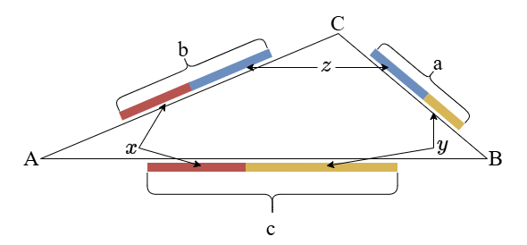
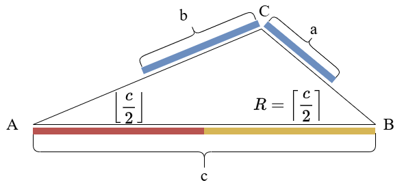
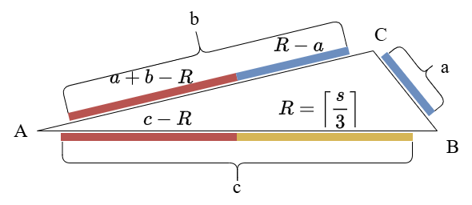

# Eat Grapes

Source: [Nowcoder](https://www.nowcoder.com/questionTerminal/14c0359fb77a48319f0122ec175c9ada)

Chinese version: [eat_grapes.md](eat_grapes.md)

## 1. Problem

There are three kinds of grapes, with quantities $a$, $b$, and $c$. There are three people:

- The first person can only eat grape types 1 and 2.
- The second person can only eat grape types 2 and 3.
- The third person can only eat grape types 1 and 3.

Arrange the three people so that all grapes are eaten, and the number of grapes eaten by the person who eats the most is as small as possible.

### Input

$a$, $b$, and $c$ are positive integers.

### Output

Output the minimum possible number of grapes eaten by the person who eats the most.

## 2. Conclusion

Let $s = a + b + c$, and let $m = \max(a, b, c)$. The answer is:

$$
\max\left(\left\lceil \frac{s}{3} \right\rceil,\left\lceil \frac{m}{2} \right\rceil\right)
$$

Code:

```python
def find_min_max(a, b, c):
    return max((a + b + c + 2) // 3, (max(a, b, c) + 1) // 2)
```

The rest of this document proves the conclusion.

## 3. Visualization

We can view the three people as sitting at vertices $A$, $B$, and $C$ of a triangular table, with the three grape types placed on the three edges. Each grape type can only be eaten by the two adjacent people at the ends of that edge.

The red, yellow, and blue segments in the figure represent the numbers of grapes eaten by the three people. These segments are only used to illustrate the allocation relationship; they do not need to form a real triangle.



## 4. Lower Bound Derivation

Without loss of generality, sort the three grape quantities and assume:

$$
a \leqslant b \leqslant c
$$

Now the largest grape type has quantity $c$. Let the final numbers of grapes eaten by the three people be $x$, $y$, and $z$.

Since all grapes must be eaten:

$$
x + y + z = a + b + c = s
$$

Therefore, the person who eats the most must eat at least the average:

$$
\max(x, y, z) \geqslant \left\lceil \frac{s}{3} \right\rceil
$$

On the other hand, the largest grape type has $c$ grapes, and it can only be eaten by two people. So at least one of those two people must eat at least half of it:

$$
\max(x, y, z) \geqslant \left\lceil \frac{c}{2} \right\rceil
$$

Thus the answer is at least:

$$
\max\left(\left\lceil \frac{s}{3} \right\rceil,\left\lceil \frac{c}{2} \right\rceil\right)
$$

It remains to prove that this lower bound is always achievable.

## 5. Proof

Let:

$$
R = \max\left(\left\lceil \frac{s}{3} \right\rceil,\left\lceil \frac{c}{2} \right\rceil\right)
$$

The previous section shows that no valid allocation can have an answer smaller than $R$. Now we only need to prove that there is always an allocation where each person eats at most $R$ grapes.

Think of the problem as a capacity allocation problem:

- Each grape type is a batch of items to allocate.
- Each person has capacity $R$.
- Each grape type can only flow to the two people who can eat it.

This is a small bipartite allocation problem. By the max-flow min-cut theorem, if every group of grape types has total quantity no larger than the total capacity of the people who can eat that group, then a complete allocation exists. In other words, we only need to check whether any capacity bottleneck exists.

### One Grape Type

Any single grape type has at most $c$ grapes, and it can be eaten by two people. The total capacity of those two people is $2R$.

Because:

$$
R \geqslant \left\lceil \frac{c}{2} \right\rceil
$$

we have:

$$
c \leqslant 2R
$$

So no single grape type exceeds the total capacity of the two people who can eat it.

### Two Or Three Grape Types

Any two grape types together can be eaten by all three people. For example:

- Grape types 1 and 2 can be eaten collectively by people 1, 2, and 3.
- Grape types 1 and 3 can also be eaten collectively by people 1, 2, and 3.
- Grape types 2 and 3 are the same.

The total capacity of the three people is $3R$. Because:

$$
R \geqslant \left\lceil \frac{s}{3} \right\rceil
$$

we have:

$$
s \leqslant 3R
$$

The total quantity of any two grape types is no more than $s$, and the total quantity of all three grape types is exactly $s$. Therefore, neither two grape types nor three grape types can exceed the total capacity of all three people.

### Therefore It Is Feasible

We have checked every possible bottleneck:

- A single grape type does not exceed the capacity of its two eligible people.
- Two or three grape types do not exceed the total capacity of all three people.

Therefore, there must be an allocation where each person eats at most $R$ grapes.

Combining this with the lower bound, the answer is:

$$
\max\left(\left\lceil \frac{s}{3} \right\rceil,\left\lceil \frac{c}{2} \right\rceil\right)
$$

The following two figures show the intuition for the cases where the largest grape type dominates and where the total average dominates. They are a constructive way to understand the capacity proof above.

The first figure corresponds to the case where the largest grape type $c$ dominates:

$$
\frac{s}{3} \leqslant \frac{c}{2}
$$

Then $R = \left\lceil \frac{c}{2} \right\rceil$. The bottleneck is that $c$ can only be eaten by the red and yellow people, so we first split $c$ between them as evenly as possible: the yellow person eats $\left\lceil \frac{c}{2} \right\rceil$, and the red person eats $\left\lfloor \frac{c}{2} \right\rfloor$. Since:

$$
\frac{s}{3} \leqslant \frac{c}{2}
\implies \frac{a+b+c}{3} \leqslant \frac{c}{2}
\implies a+b \leqslant \frac{c}{2}
\implies a+b \leqslant \left\lceil \frac{c}{2} \right\rceil
\implies a+b \leqslant R
$$

the remaining $a + b$ grapes do not exceed the upper bound $R$ and can be eaten by the blue person. Therefore, the maximum is $R$.



The second figure corresponds to the case where the total average dominates:

$$
\frac{s}{3} > \frac{c}{2}
$$

Then $R = \left\lceil \frac{s}{3} \right\rceil$. Because $a \leqslant b \leqslant c$, we have $c \geqslant \frac{s}{3}$, so $c \geqslant R$. Therefore, we can first let the yellow person eat $R$ grapes from type $c$. Next, we need to show that the blue person can also eat exactly $R$ grapes, meaning all $a$ grapes plus some of $b$ are enough to reach $R$.

From $a \leqslant b \leqslant c$:

$$
2a \leqslant b + c
\implies a \leqslant \frac{a+b+c}{3}
\implies a \leqslant \frac{s}{3}
\implies a \leqslant \left\lceil \frac{s}{3} \right\rceil
\implies a \leqslant R
$$

Also, from the current case $\frac{s}{3} > \frac{c}{2}$:

$$
\frac{s}{3} > \frac{c}{2}
\implies \frac{a+b+c}{3} > \frac{c}{2}
\implies 2(a+b) > c
\implies 3(a+b) > a+b+c
\implies a+b > \frac{a+b+c}{3}
\implies a+b > \frac{s}{3}
\implies a+b \geqslant \left\lceil \frac{s}{3} \right\rceil
\implies a+b \geqslant R
$$

Because $a+b$ is an integer, $a+b > \frac{s}{3}$ implies $a+b \geqslant \left\lceil \frac{s}{3} \right\rceil$. Thus $R-a \geqslant 0$, $a+b-R \geqslant 0$, and $c-R \geqslant 0$, so the following allocation amounts are valid.

Let the blue person eat all $a$ grapes and $R-a$ grapes from type $b$. Then the red person eats the remaining $c-R$ grapes from type $c$ and the remaining part of type $b$:

$$
b-(R-a)=a+b-R
$$

The red person eats:

$$
c-R+a+b-R=a+b+c-2R
$$

Since:

$$
s=a+b+c
\implies \frac{s}{3} + 2 \cdot \frac{s}{3} = a+b+c
\implies \left\lceil \frac{s}{3} \right\rceil + 2 \cdot \left\lceil \frac{s}{3} \right\rceil \geqslant a+b+c
\implies a+b+c-2\left\lceil \frac{s}{3} \right\rceil \leqslant \left\lceil \frac{s}{3} \right\rceil
\implies a+b+c-2R \leqslant R
\implies c-R+a+b-R \leqslant R
$$

the red person also eats no more than the upper bound $R$. Therefore, the maximum is $R$.



## 6. Complexity

We only need to compute the sum and the maximum.

- Time complexity: $O(1)$
- Space complexity: $O(1)$
